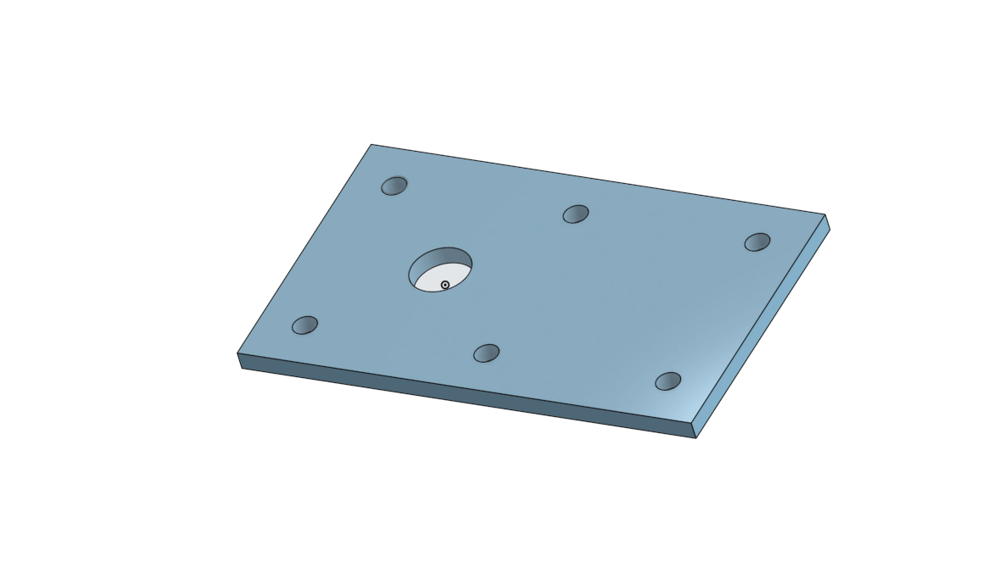
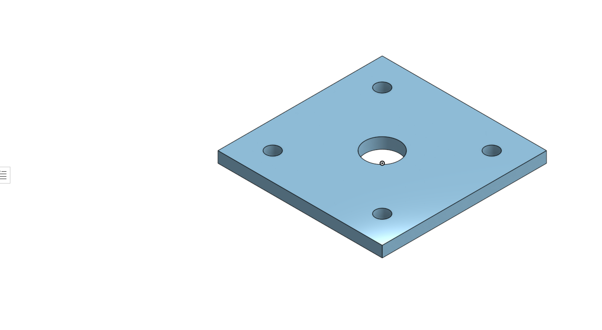
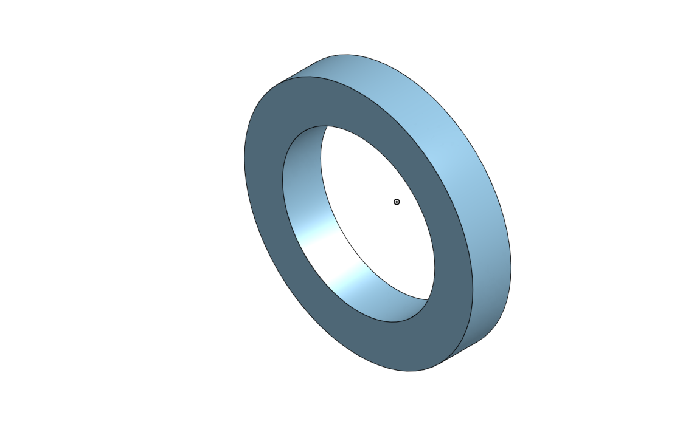
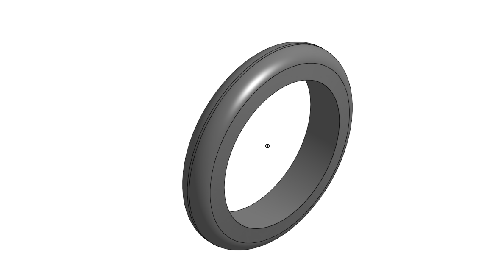

# Basic_Onshape_CAD.

## TABLE OF CONTENTS
### Caster
* [Base](#Base)
* [Mount](#Mount)
* [Bearing](#Bearing)
* [Fork](#Fork)
* [Tire](#Tire)
* [Axle and Collar](#Axle-and-Collar)
* [Wheel and Bearing](#Wheel-and-Bearing)
* [wheel and Axle Assembly](wheel-and-Axle-Assembly)
* [Caster Assembly](#Caster-Assembly)

### Dorothy's Dowel Pins
* [Dorothy's Dowel Pins](#Dorothy's Dowel Pins)
 
### Caster
## Base
 
 
 ## Mount
 
 
 ## Bearing
 
 
 ## Fork
 
 
 ## Tire
 
 
 ## Axle and Collar
 
 
 ## Wheel and Bearing
 
 
 ## Sub Assembly
 
 
 ## Caster Assembly
 
 
 # Dorothy's Dowel Pins
 
 ### Shaded
 
 
  ### Hiden Edges Visible
 
